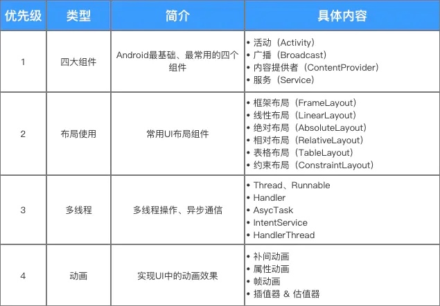
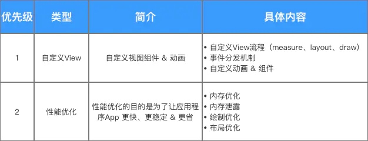
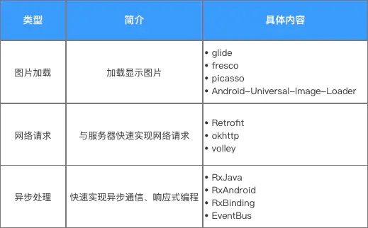
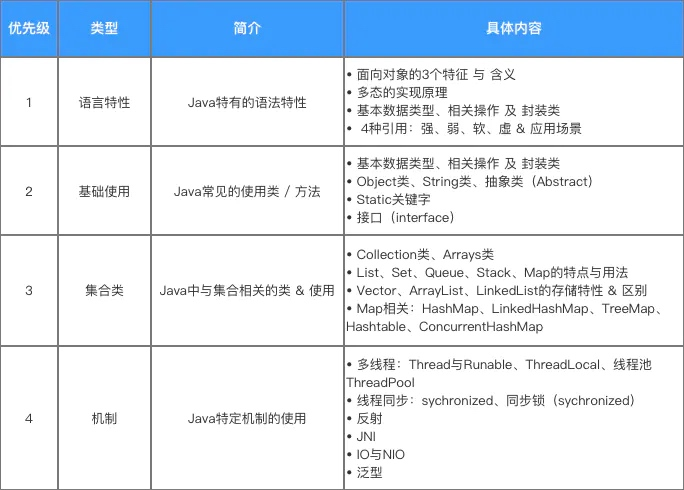
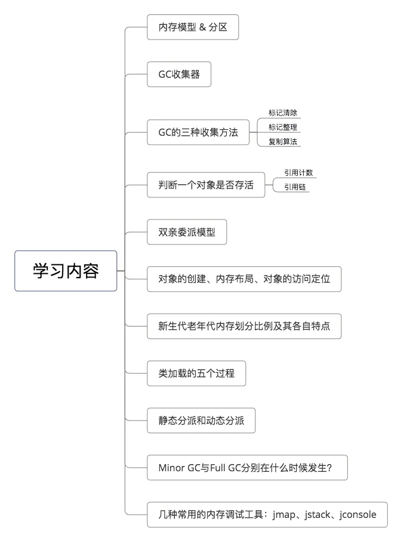
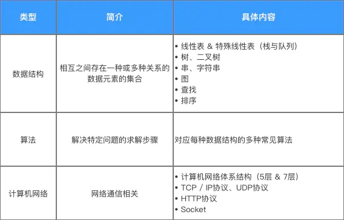
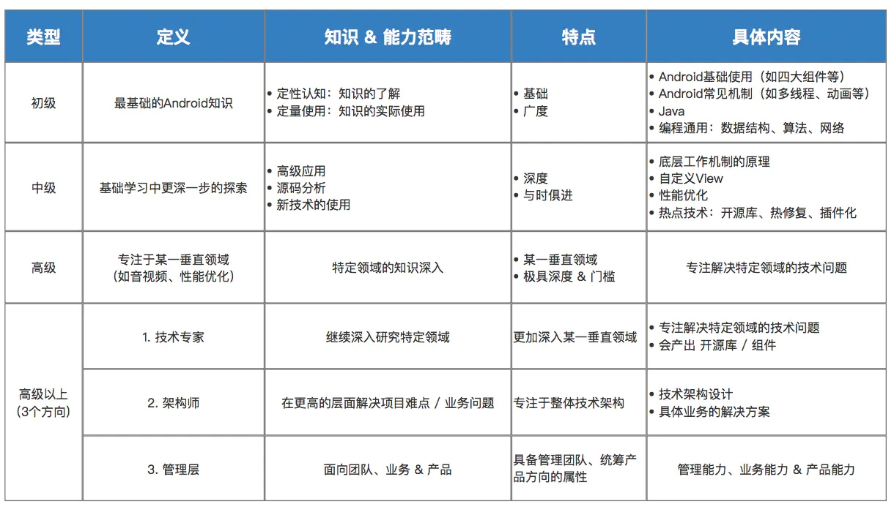
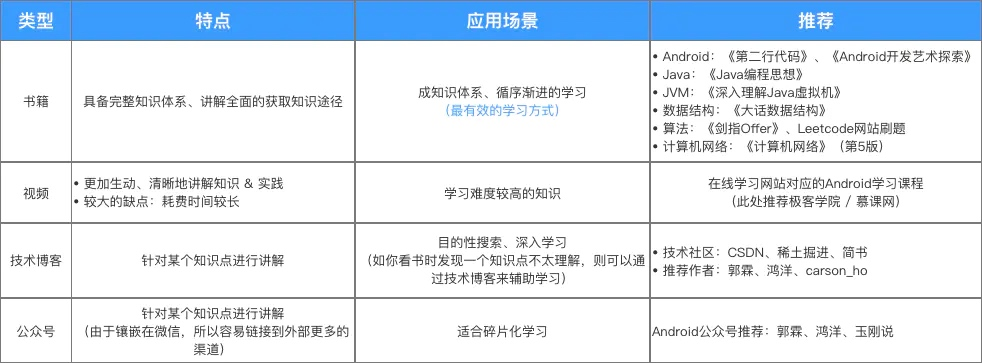

# Android学习体系
## Android基础
针对Android基础和常用知识，按照优先级最主要的知识点主要包括：四大组件、布局使用、多线程、动画

Handler:
[Android Handler：手把手带你深入分析 Handler机制源码](https://www.jianshu.com/p/b4d745c7ff7a)
## Android进阶
针对Android进阶知识，按照优先级最主要的知识点主要包括：自定义View、性能优化

自定义View:
[Android：一篇文章带你完全梳理自定义View工作流程！](https://www.jianshu.com/p/e79a55c141d6)
事件分发：
[Android事件分发机制详解：史上最全面、最易懂](https://www.jianshu.com/p/38015afcdb58)
Frameword相关：
[Zygote](framework/Zygote.md)
## Android热门技术
除了基础日常使用的Android知识，我们还需时刻关注行业动态，与时俱进的学习新技术，如近些年来较为热门的Android新兴技术包括：Flutter、热修复、插件化等；
同时，了解学习常用的开源库也十分重要，常用的开源库主要包括图片加载、网络请求、异步处理的开源库

## Java
Android是基于Java的，所以学习Java和Java虚拟机（JVM）十分重要
学习Java不需要类似后端那么深入，我认为作为Android开发者，学习的内容包括：语言特性、基础使用、集合类和机制

HashMap:
[Java：这是一份全面 & 详细的HashMap 1.7源码分析指南 by Carson_Ho](https://www.jianshu.com/p/e5c8a814c0ca)
对于Java虚拟机（JVM），属于底层 & 原理性的内容，具体介绍 & 学习的内容包括

## 计算机基础
除了学习Android特定技术外，对于程序员来说，最基本的计算机基础素养也十分重要的
主要包括数据结构、算法和计算机网络

数据结构学习：
恋上数据结构与算法
# Android学习路径
## Android开发水平

## Android学习途径
最有效的途径是：书籍 > 视频 > 技术博客 > 公众号

