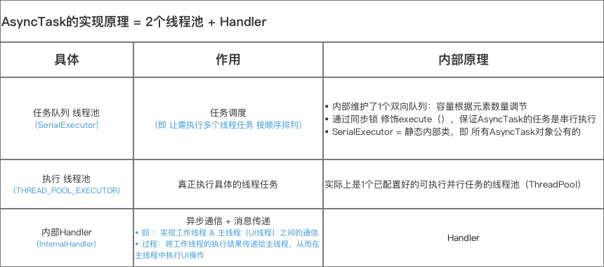
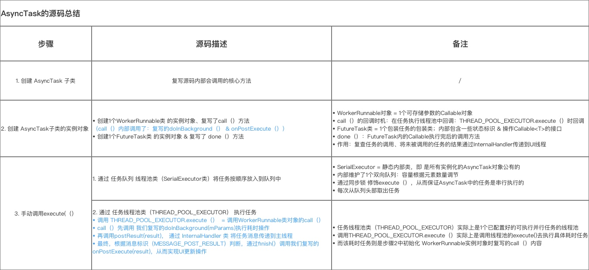

# Android AsyncTask是什么，AsyncTask的原理，AsyncTask的问题和缺陷
## AsyncTask是什么？（What）
AsyncTask是一种轻量级的异步任务类，它可以在线程池中执行后台任务，然后把执行的进度和最终结果传递给主线程并在主线程中更新UI。

AsyncTask是一个抽象的泛型类，它提供了Params、Progress和Result这三个泛型参数，其中Params表示参数的类型，Progress表示后台任务的执行进度和类型，而Result则表示后台任务的返回结果的类型，如果AsyncTask不需要传递具体的参数，那么这三个泛型参数可以用Void来代替。

## AsyncTask原理（How）
AsyncTask的实现原理 = 线程池 + Handler
其中：线程池用于线程调度、复用 & 执行任务；Handler 用于异步通信

- AsyncTask中有两个线程池（SerialExecutor和THREAD_POOL_EXECUTOR）和一个Handler（InternalHandler），其中线程池SerialExecutor用于任务的排队，而线程池THREAD_POOL_EXECUTOR用于真正地执行任务，InternalHandler用于将执行环境从线程池切换到主线程。
- sHandler是一个静态的Handler对象，为了能够将执行环境切换到主线程，这就要求sHandler这个对象必须在主线程创建。由于静态成员会在加载类的时候进行初始化，因此这就变相要求AsyncTask的类必须在主线程中加载，否则同一个进程中的AsyncTask都将无法正常工作。

## AsyncTask注意事项
### 关于线程池：

AsyncTask对应的线程池ThreadPoolExecutor都是进程范围内共享的，且都是static的，所以是Asynctask控制着进程范围内所有的子类实例。由于这个限制的存在，当使用默认线程池时，如果线程数超过线程池的最大容量，线程池就会爆掉(3.0后默认串行执行，不会出现个问题)。针对这种情况，可以尝试自定义线程池，配合Asynctask使用。

### 关于默认线程池：

AsyncTask里面线程池是一个核心线程数为CPU + 1，最大线程数为CPU * 2 + 1，工作队列长度为128的线程池，线程等待队列的最大等待数为28，但是可以自定义线程池。线程池是由AsyncTask来处理的，线程池允许tasks并行运行，需要注意的是并发情况下数据的一致性问题，新数据可能会被老数据覆盖掉。所以希望tasks能够串行运行的话，使用SERIAL_EXECUTOR。

### AsyncTask在不同的SDK版本中的区别：

调用AsyncTask的execute方法不能立即执行程序的原因及改善方案通过查阅官方文档发现，AsyncTask首次引入时，异步任务是在一个独立的线程中顺序的执行，也就是说一次只执行一个任务，不能并行的执行，从1.6开始，AsyncTask引入了线程池，支持同时执行5个异步任务，也就是说只能有5个线程运行，超过的线程只能等待，等待前的线程直到某个执行完了才被调度和运行。换句话说，如果进程中的AsyncTask实例个数超过5个，那么假如前5都运行很长时间的话，那么第6个只能等待机会了。这是AsyncTask的一个限制，而且对于2.3以前的版本无法解决。如果你的应用需要大量的后台线程去执行任务，那么只能放弃使用AsyncTask，自己创建线程池来管理Thread。不得不说，虽然AsyncTask较Thread使用起来方便，但是它最多只能同时运行5个线程，这也大大局限了它的作用，你必须要小心设计你的应用，错开使用AsyncTask时间，尽力做到分时，或者保证数量不会大于5个，否就会遇到上面提到的问题。可能是Google意识到了AsynTask的局限性了，从Android 3.0开始对AsyncTask的API做出了一些调整：每次只启动一个线程执行一个任务，完了之后再执行第二个任务，也就是相当于只有一个后台线程在执行所提交的任务。

### 一些问题：

1.生命周期

很多开发者会认为一个在Activity中创建的AsyncTask会随着Activity的销毁而销毁。然而事实并非如此。AsynTask会一直执行，直到doInBackground()方法执行完毕，然后，如果cancel(boolean)被调用,那么onCancelled(Result result)方法会被执行；否则，执行onPostExecute(Result result)方法。如果我们的Activity销毁之前，没有取消AsyncTask，这有可能让我们的应用崩溃(crash)。因为它想要处理的view已经不存在了。所以，我们是必须确保在销毁活动之前取消任务。总之，我们使用AsyncTask需要确保AsyncTask正确的取消。

2.内存泄漏

如果AsyncTask被声明为Activity的非静态内部类，那么AsyncTask会保留一个对Activity的引用。如果Activity已经被销毁，AsyncTask的后台线程还在执行，它将继续在内存里保留这个引用，导致Activity无法被回收，引起内存泄漏。

3.结果丢失

屏幕旋转或Activity在后台被系统杀掉等情况会导致Activity的重新创建，之前运行的AsyncTask会持有一个之前Activity的引用，这个引用已经无效，这时调用onPostExecute()再去更新界面将不再生效。

4.并行还是串行

在Android1.6之前的版本，AsyncTask是串行的，在1.6之后的版本，采用线程池处理并行任务，但是从Android 3.0开始，为了避免AsyncTask所带来的并发错误，又采用一个线程来串行执行任务。可以使用executeOnExecutor()方法来并行地执行任务。