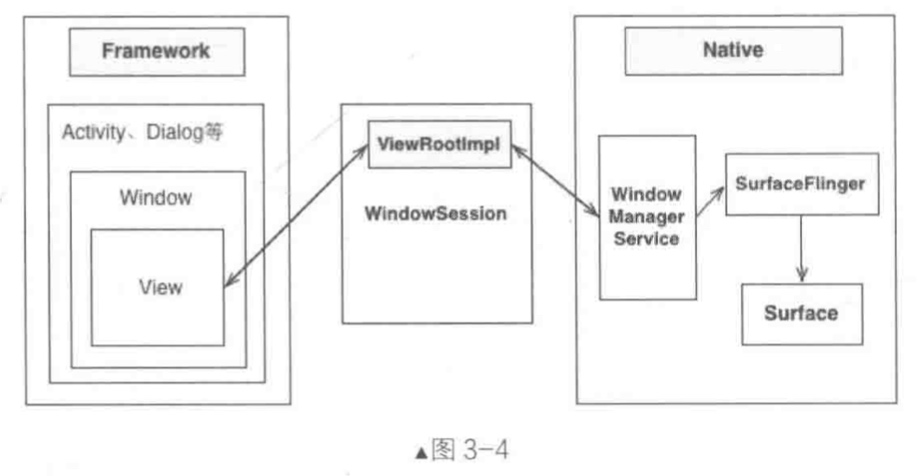
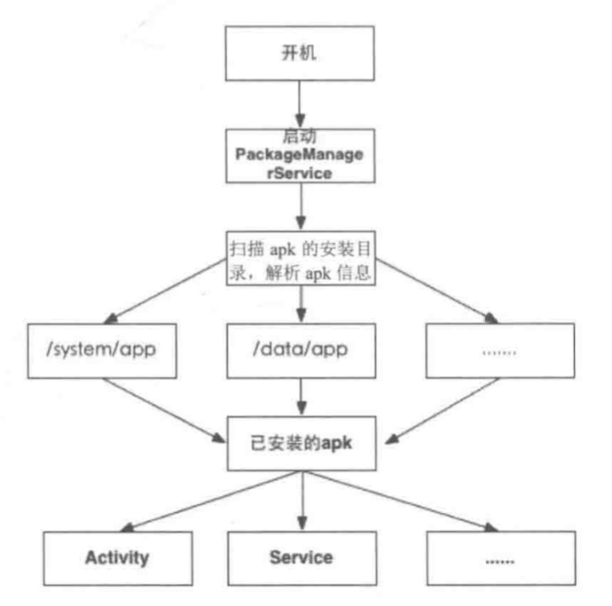

# 面向对象的六大原则
## 单一职责原则
每个类做自己的事情
## 开闭原则
对于扩展开放，对于修改封闭
## 里氏替换原则
父类的地方都可以替换成子类
继承、多态，核心原理是抽象
## 依赖倒置原则
抽象不应该依赖细节
细节应该依赖抽象
## 接口隔离原则
## 迪米特原则
最少知识原则，只与直接的朋友通信
# 单例模式
- 饿汉模式
- 懒汉模式
- Double Check Lock（DCL）
- 静态内部类实现
- 枚举实现
- 容器实现（如HashMap）
## Android源码中的单例模式
Context>>getSystemService
## LayoutInflater
PhoneLayoutInflater>>onCreateView
## 小结
推荐DCL和静态内部类实现
单例对象如果持有Context，容易内存泄漏，最好使用Application Context
# Builder 模式
## Android源码中的Builder模式
AlertDialog.Builder
## WindowManager

# 原型模式
clone
浅拷贝
深拷贝：对于引用型的字段也要采用拷贝的形式
## Intent的查找与匹配
PMS扫描系统中已安装的apk，解析apk包下的AndroidManifest

PMS会存储所有的Activity、Service等信息
启动Activity时，PMS会根据Intent查找出对应的组件列表
# 工厂方法模式

# 抽象工厂模式

# 策略模式

