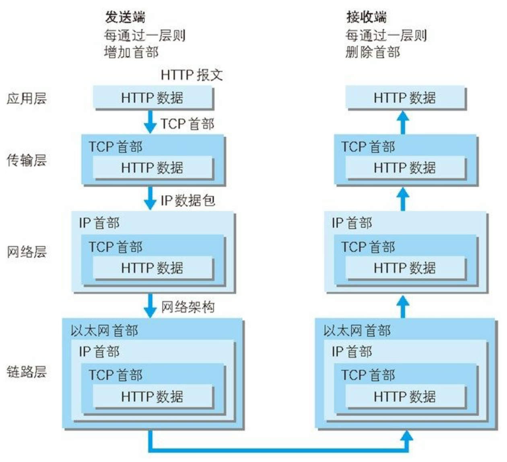
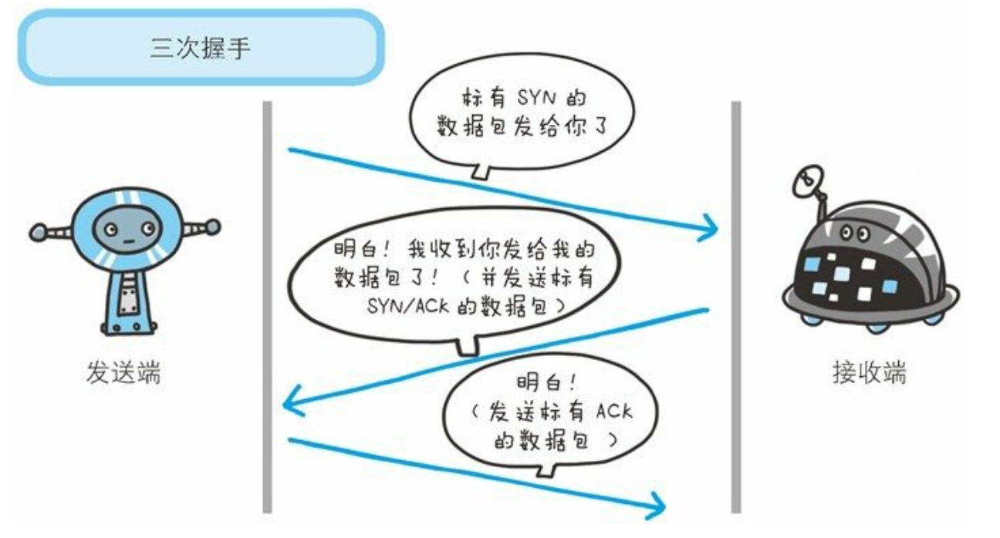
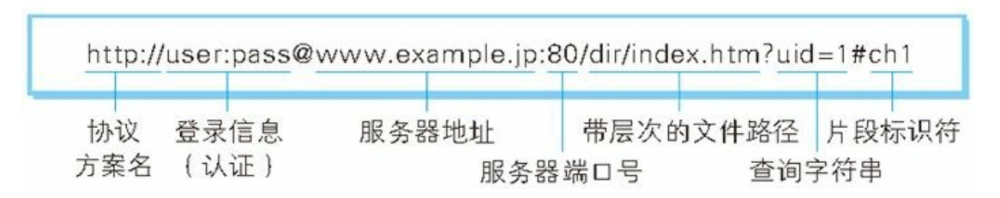
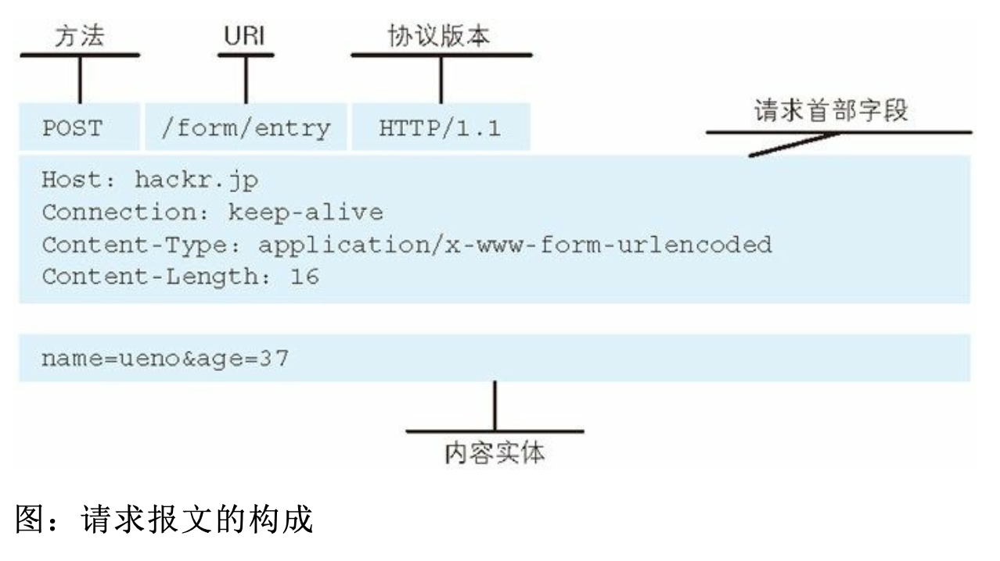
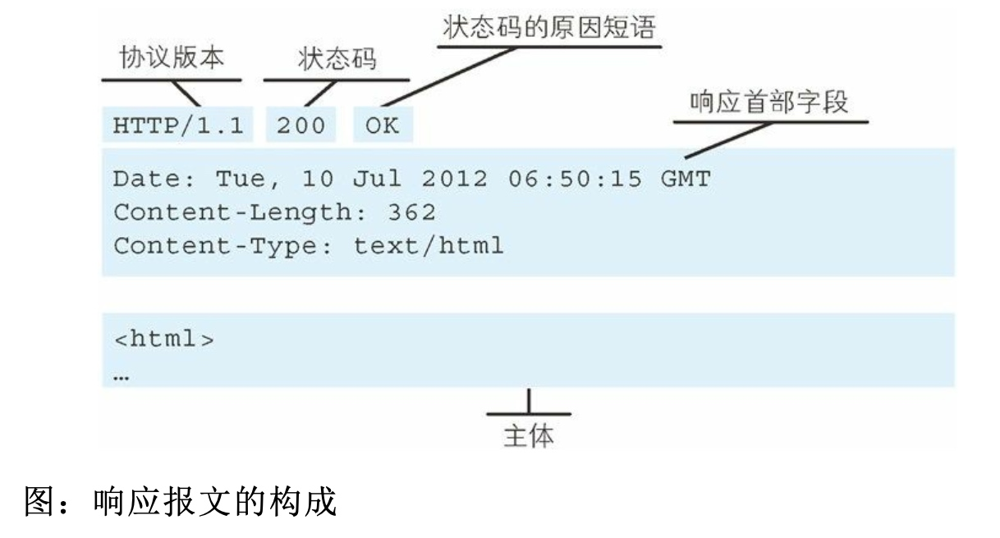
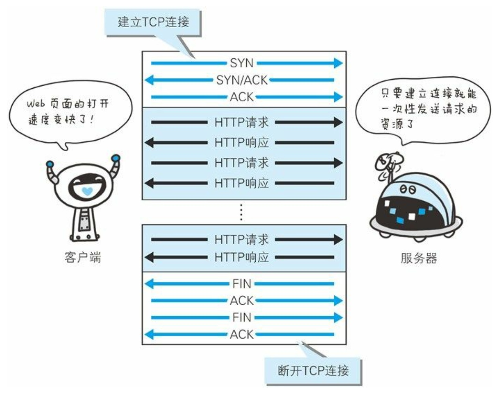
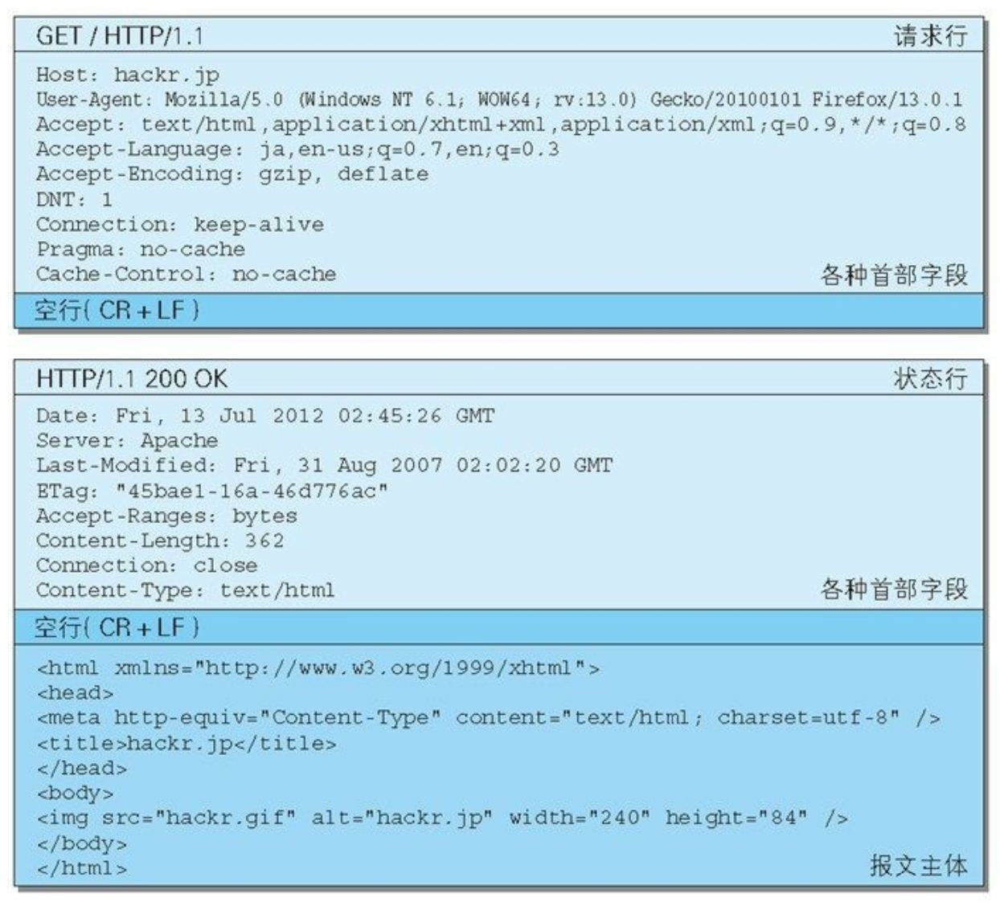

# 1.Web和网络基础
## TCP/IP协议
TCP/IP 协议族按层次分别分为以下 4 层:应用层、传输层、网络层和数据链路层
应用层：
比如，FTP，DNS，HTTP
传输层：
TCP，UDP
网络层：
处理在网络上流动的数据包
链路层(又名数据链路层，网络接口层)：
硬件

TCP三次握手

## URI和URL
URI(统一资源标识符)
URL(Uniform Resource Locator，统一资源定位符)

# 2.HTTP协议
请求必定由客户端发出，而服务器端回复响应

## HTTP是不保存状态的协议
## 方法
GET:获取资源
GET 方法用来请求访问已被 URI 识别的资源。指定的资源经服务器 端解析后返回响应内容。也就是说，如果请求的资源是文本，那就保 持原样返回;如果是像 CGI(Common Gateway Interface，通用网关接 口)那样的程序，则返回经过执行后的输出结果。
POST:传输实体主体
POST 方法用来传输实体的主体。
PUT:传输文件
HEAD:获得报文首部
DELETE:删除文件
OPTIONS:询问支持的方法
TRACE:追踪路径
CONNECT:要求用隧道协议连接代理
## 持久连接

在 HTTP/1.1 中，所有的连接默认都是持久连接
## Cookie
Cookie 技术通过在请求和响应报文中写入 Cookie 信息来控制客户端的状态。
# 3.HTTP报文

