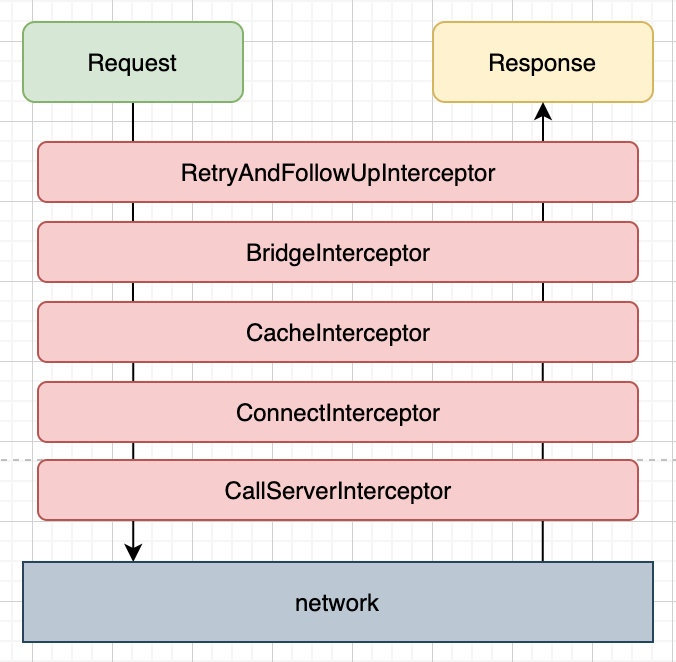
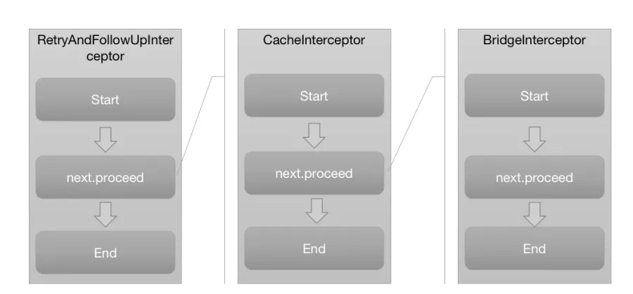

> 源码版本3.14.9，即Java版本的最新版，4.0版本以上使用Kotlin
> [源码地址](https://github.com/square/okhttp/tree/parent-3.14.9)
## 1.使用方法
引入依赖
`implementation 'com.squareup.okhttp3:okhttp:3.14.9'
`
异步网络请求（项目中通常使用异步请求方法，Android要求必须在子线程中执行网络请求）

```java
// 1.创建OkHttpClient，核心管理类
OkHttpClient client = new OkHttpClient.Builder().build();
// 2.创建Request
Request request = new Request.Builder().url("https://github.com/").build();
// 3.根据Request创建一个Call对象
Call call = client.newCall(request);
// 4.执行Call的enqueue，此为异步方法，不会阻塞线程，在回调onResponse方法里面得到响应结果
call.enqueue(new Callback() {
    @Override
    public void onFailure(Call call, IOException e) {
        // 请求失败的回调
    }
    @Override
    public void onResponse(Call call, Response response) throws IOException {
        // 回调里面得到响应结果response，需要注意此时是在子线程，如果需要更新UI必须切回主线程
    }
});
```
这就是OkHttp的常见用法
* 一，创建OkHttpClient，这个是整个OkHttp的核心管理类，所有的内部逻辑和对象由OkHttpClient统一管理，它通过Builder构造器生成，构造参数和类成员很多，此时可以对OkHttp进行配置。
* 二，创建Request，Request是我们发送请求封装类，对应Http协议中的请求报文，内部包含请求方法method，请求地址method，请求头headers，请求体body，符合Http协议所定义的请求内容。
* 三，创建Call，源码里描述Call是准备好执行的一个request，它可以被取消，它可以表示一个request/response对，只能被执行一次。它的实现类是RealCall，虽然OkHttpClient是整个OkHttp的核心管理类，但是真正发出请求并且组织逻辑的是RealCall类，它同时肩负了调度和责任链组织的两大重任。
* 四，得到Response，Call调用同步execute或者异步enqueue方法得到请求响应结果Response，Response是请求响应封装类，内部包含响应码code，响应消息message，响应头header，响应体body，还有一些其它信息，符合Http协议所定义的响应内容。

## 2.整体流程分析
先给出一张OkHttp的整体流程图，下面我们具体分析：

OkHttpClient和Request都可以使用Builder构建模式创建，从OkHttpClient的newCall方法开始分析，其调用了RealCall的newRealCall方法。Call是一个接口，
RealCall是其实现类。

```java
// OkHttpClient.java
Call newCall(Request request) {
    return RealCall.newRealCall(this, request, false);
}

// RealCall.java
RealCall newRealCall(OkHttpClient client, Request originalRequest, boolean forWebSocket) {
    RealCall call = new RealCall(client, originalRequest, forWebSocket);
    // Transmitter翻译为传达者，主要用于更新状态信息
    call.transmitter = new Transmitter(client, call);
    return call;
}
```
接下来执行RealCall的enqueue方法

```java
// RealCall.java
void enqueue(Callback responseCallback) {
    //回调eventListener，实时汇报状态，先忽略
    transmitter.callStart();
    //用AsyncCall封装Callback，由调度中心dispatcher安排进入执行队列
    client.dispatcher().enqueue(new AsyncCall(responseCallback));
}
```
内部调用了Dispatcher的enqueue方法，并创建了一个AsyncCall作为参数。

```java
// Dispatcher.java
int maxRequests = 64;  // 最多同时请求数为64
int maxRequestsPerHost = 5;  // 每个主机最多同时请求数为5

enqueue(AsyncCall call) {
    synchronized (this) {
        // 加入异步请求准备队列
        readyAsyncCalls.add(call);
        if (!call.get().forWebSocket) {
            //查找和call请求相同host的AsyncCall
            AsyncCall existingCall = findExistingCallWithHost(call.host());
            //复用此host的计数器callsPerHost，用于统计同一个host的请求数
            if (existingCall != null) call.reuseCallsPerHostFrom(existingCall);
        }
    }
    // 如果满足条件，就会执行请求
    promoteAndExecute();
}

boolean promoteAndExecute() {
    // 收集可以执行的AsyncCall
    List<AsyncCall> executableCalls = new ArrayList<>();
    boolean isRunning;
    synchronized (this) {
        for (Iterator<AsyncCall> i = readyAsyncCalls.iterator(); i.hasNext(); ) {
            AsyncCall asyncCall = i.next();
            // 如果正在执行的请求数超过最大值，则跳出
            if (runningAsyncCalls.size() >= maxRequests) break;
            // 如果请求同一个主机的请求数超过允许的最大值，则跳出
            if (asyncCall.callsPerHost().get() >= maxRequestsPerHost) continue;
            // 从准备队列里移除
            i.remove();
            // 同一个主机的请求数量+1
            asyncCall.callsPerHost().incrementAndGet();
            // 把AsyncCall存起来
            executableCalls.add(asyncCall);
            // 加入执行请求队列
            runningAsyncCalls.add(asyncCall);
        }
        isRunning = runningCallsCount() > 0;
    }
    // 遍历并执行可执行队列的AsyncCall
    for (int i = 0, size = executableCalls.size(); i < size; i++) {
        AsyncCall asyncCall = executableCalls.get(i);
        asyncCall.executeOn(executorService());
    }
    return isRunning;
}
```
executorService()方法返回一个缓存线程池，核心线程数为0，最大线程数是Integer.MAX_VALUE相当于没有限制，因为在Dispatcher中已经，空闲线程会等待60S，超时未使用将被销毁。

```java
// Dispatcher.java
synchronized ExecutorService executorService() {
    if (executorService == null) {
        executorService =
            new ThreadPoolExecutor(0, Integer.MAX_VALUE, 
                                   60, TimeUnit.SECONDS,
                                   new SynchronousQueue<>(), 
                                   Util.threadFactory("OkHttp Dispatcher", false));
    }
    return executorService;
}
```
AsyncCall继承自Runnable，调用线程池的execute(this)其实就是在子线程中执行run()方法，父类的run()方法调用了execute()方法，所以最终调用到AsyncCall的execute()方法，通过核心方法getResponseWithInterceptorChain()获取到响应Response。

```java
// AsyncCall.java
// 目前每个主机（域名）有多少个会话call，原子计数
volatile AtomicInteger callsPerHost = new AtomicInteger(0);

void executeOn(ExecutorService executorService) {
    boolean success = false;
    try {
        // 线程池运行Runnable，执行run，父类的run方法调用了execute()方法
        executorService.execute(this);
        success = true;
    } catch (RejectedExecutionException e) {
        InterruptedIOException ioException = new InterruptedIOException("executor rejected");
        ioException.initCause(e);
        transmitter.noMoreExchanges(ioException);
        // 失败回调
        responseCallback.onFailure(RealCall.this, ioException);
    } finally {
        if (!success) {
            // 最后都会结束call
            client.dispatcher().finished(this);
        }
    }
}

void execute() {
    try {
        // 得到Response，核心方法，下个小节分析
        Response response = getResponseWithInterceptorChain(); 
        // 成功（一般response.isSuccessful()才是真正意义上的成功）
        responseCallback.onResponse(RealCall.this, response);
    } catch (IOException e) {
        // 失败
        responseCallback.onFailure(RealCall.this, e);
    } catch (Throwable t) {
        cancel();
        IOException canceledException = new IOException("canceled due to " + t);
        canceledException.addSuppressed(t);
        // 失败
        responseCallback.onFailure(RealCall.this, canceledException);
        throw t;
    } finally {
        // 结束航班，callsPerHost减1，runningAsyncCalls移除AsyncCall
        client.dispatcher().finished(this);
    }
}
```
最后调用Dispatcher的finished()方法将当前call移除队列，并调用promoteAndExecute()方法去执行等待队列的请求，一次完整的请求流程到此结束。

```java
// Dispatcher.java
void finished(AsyncCall call) {
    call.callsPerHost().decrementAndGet();
    finished(runningAsyncCalls, call);
}

private <T> void finished(Deque<T> calls, T call) {
    // 正在执行的请求数为0时的回调
    Runnable idleCallback;
    synchronized (this) {
      if (!calls.remove(call)) throw new AssertionError("Call wasn't in-flight!");
      idleCallback = this.idleCallback;
    }

    boolean isRunning = promoteAndExecute();

    if (!isRunning && idleCallback != null) {
      idleCallback.run();
    }
}
```

## 3.核心getResponseWithInterceptorChain()方法分析

```java
// RealCall.java
Response getResponseWithInterceptorChain() throws IOException {
    List<Interceptor> interceptors = new ArrayList<>();
    // 添加自定义拦截器
    interceptors.addAll(client.interceptors());
    // 添加默认拦截器
    interceptors.add(new RetryAndFollowUpInterceptor(client));
    interceptors.add(new BridgeInterceptor(client.cookieJar()));
    interceptors.add(new CacheInterceptor(client.internalCache()));
    interceptors.add(new ConnectInterceptor(client));
    if (!forWebSocket) {
        // 添加自定义网络拦截器（在ConnectInterceptor后面，此时网络连接已准备好）
        interceptors.addAll(client.networkInterceptors());
    }
    // 添加默认拦截器，共4+1=5个
    interceptors.add(new CallServerInterceptor(forWebSocket));
    // 创建拦截器链
    Interceptor.Chain chain =
        new RealInterceptorChain(interceptors, transmitter, null, 0,
                                 originalRequest, this, client.connectTimeoutMillis(),
                                 client.readTimeoutMillis(), client.writeTimeoutMillis());
    // 放行
    Response response = chain.proceed(originalRequest);
    return response;
}
```
拦截器链基于责任链模式，即不同的拦截器有不同的职责，链上的拦截器会按顺序挨个处理，在Request发出之前，Response返回之前，插入一些定制逻辑，这样可以方便的扩展需求。当然责任链模式也有不足，就是只要一个环节阻塞住了，就会拖慢整体运行（效率）；同时链条越长，产生的中间对象就越多（内存）。

OkHttp的核心逻辑就是一堆拦截器，那么它们是如何构造并关联到一起的呢？这里就要来分析RealInterceptorChain这个类了。通过前面的分析可知，RealCall将Interceptors一个一个添加到List之后 ，就构造生成了一个RealInterceptorChain对象，并调用chain.proceed获得响应结果。那么就来分析下chain.proceed()。

```java
// RealInterceptorChain.java
Response proceed(Request request, Transmitter transmitter,Exchange exchange)
    throws IOException {
    // 传入index + 1，可以访问下一个拦截器
    RealInterceptorChain next = 
        new RealInterceptorChain(interceptors, transmitter, exchange,
                                 index + 1, request, call, connectTimeout, 
                                 readTimeout, writeTimeout);
    Interceptor interceptor = interceptors.get(index);
    // 执行第一个拦截器，同时传入next
    Response response = interceptor.intercept(next);
    // 等所有拦截器处理完，就能返回Response了
    return response;
}
```
根据对RealInterceptorChain的源码解析，可得到如下示意图

结合源码和该示意图，可以得到如下结论：

* 拦截器按照添加顺序依次执行
* 拦截器的执行从RealInterceptorChain.proceed()开始，进入到第一个拦截器的执行逻辑
* 每个拦截器在执行之前，会将剩余尚未执行的拦截器组成新的RealInterceptorChain
* 拦截器的逻辑被新的责任链调用next.proceed()切分为start、next.proceed、end这三个部分依次执行
* next.proceed() 所代表的其实就是剩余所有拦截器的执行逻辑
* 所有拦截器最终形成一个层层内嵌的嵌套结构

了解了上面拦截器的构造过程，我们再来一个个的分析每个拦截器的功能和作用。
OkHttp总共添加了五个拦截器（不包含自定义的拦截器如client.interceptors和client.networkInterceptors）
先来大概的了解下每一个拦截器的作用

* RetryAndFollowUpInterceptor - 失败和重定向拦截器
* BridgeInterceptor - 封装request和response拦截器
* CacheInterceptor - 缓存相关的过滤器，负责读取缓存直接返回、更新缓存
* ConnectInterceptor - 连接服务，负责和服务器建立连接，这里才是真正的请求网络
* CallServerInterceptor - 执行流操作（写出请求体、获得响应数据) 负责向服务器发送请求数据、从服务器读取响应数据、进行http请求报文的封装与请求报文的解析

下面就来一个个的拦截器进行分析。

