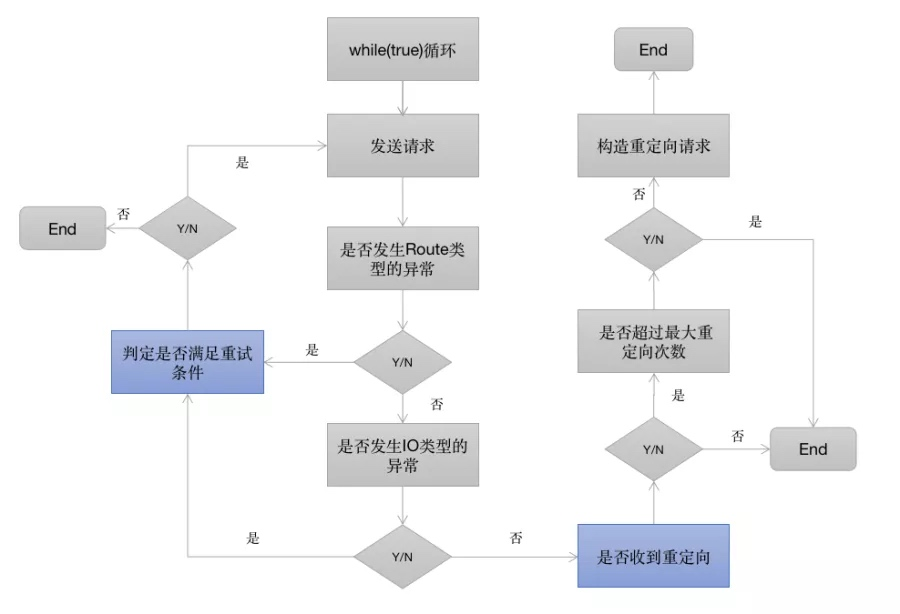
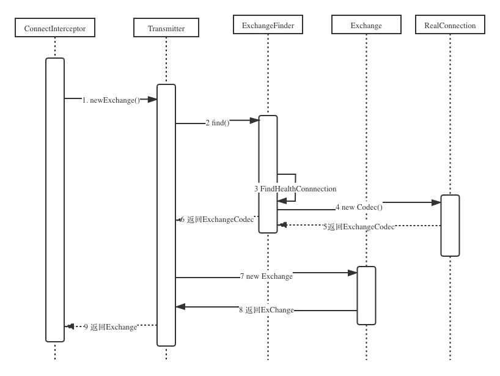
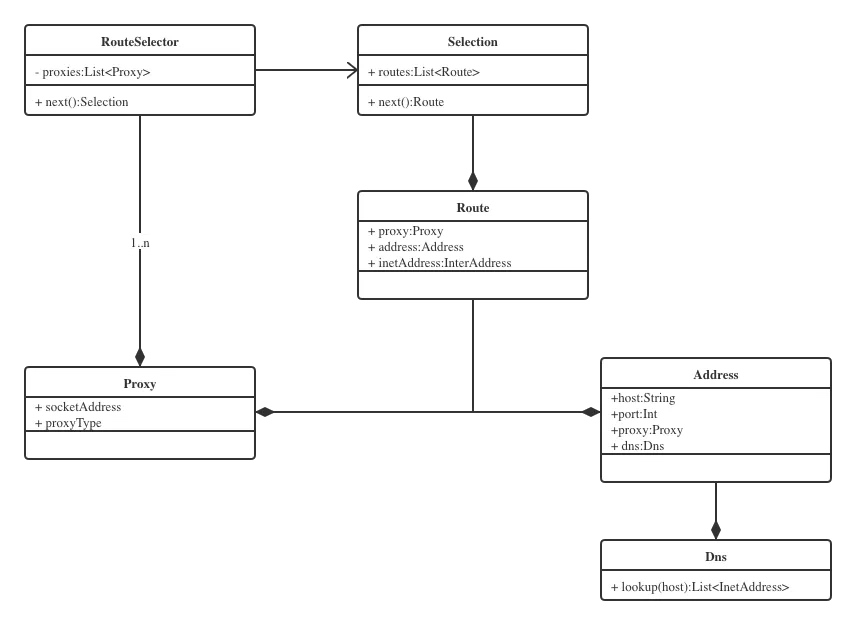

> 源码版本3.14.9，即Java版本的最新版，4.0版本以上使用Kotlin
> [源码地址](https://github.com/square/okhttp/tree/parent-3.14.9)
## 1.使用方法
引入依赖
`implementation 'com.squareup.okhttp3:okhttp:3.14.9'
`
异步网络请求（项目中通常使用异步请求方法，Android要求必须在子线程中执行网络请求）

```java
// 1.创建OkHttpClient，核心管理类
OkHttpClient client = new OkHttpClient.Builder().build();
// 2.创建Request
Request request = new Request.Builder().url("https://github.com/").build();
// 3.根据Request创建一个Call对象
Call call = client.newCall(request);
// 4.执行Call的enqueue，此为异步方法，不会阻塞线程，在回调onResponse方法里面得到响应结果
call.enqueue(new Callback() {
    @Override
    public void onFailure(Call call, IOException e) {
        // 请求失败的回调
    }
    @Override
    public void onResponse(Call call, Response response) throws IOException {
        // 回调里面得到响应结果response，需要注意此时是在子线程，如果需要更新UI必须切回主线程
    }
});
```
这就是OkHttp的常见用法
* 一，创建OkHttpClient，这个是整个OkHttp的核心管理类，所有的内部逻辑和对象由OkHttpClient统一管理，它通过Builder构造器生成，构造参数和类成员很多，此时可以对OkHttp进行配置。
* 二，创建Request，Request是我们发送请求封装类，对应Http协议中的请求报文，内部包含请求方法method，请求地址method，请求头headers，请求体body，符合Http协议所定义的请求内容。
* 三，创建Call，源码里描述Call是准备好执行的一个request，它可以被取消，它可以表示一个request/response对，只能被执行一次。它的实现类是RealCall，虽然OkHttpClient是整个OkHttp的核心管理类，但是真正发出请求并且组织逻辑的是RealCall类，它同时肩负了调度和责任链组织的两大重任。
* 四，得到Response，Call调用同步execute或者异步enqueue方法得到请求响应结果Response，Response是请求响应封装类，内部包含响应码code，响应消息message，响应头header，响应体body，还有一些其它信息，符合Http协议所定义的响应内容。

## 2.整体流程分析
先给出一张OkHttp的整体流程图，下面我们具体分析：

OkHttpClient和Request都可以使用Builder构建模式创建，从OkHttpClient的newCall方法开始分析，其调用了RealCall的newRealCall方法。Call是一个接口，
RealCall是其实现类。

```java
// OkHttpClient.java
Call newCall(Request request) {
    return RealCall.newRealCall(this, request, false);
}

// RealCall.java
RealCall newRealCall(OkHttpClient client, Request originalRequest, boolean forWebSocket) {
    RealCall call = new RealCall(client, originalRequest, forWebSocket);
    // Transmitter翻译为传达者，主要用于更新状态信息
    call.transmitter = new Transmitter(client, call);
    return call;
}
```
接下来执行RealCall的enqueue方法

```java
// RealCall.java
void enqueue(Callback responseCallback) {
    //回调eventListener，实时汇报状态，先忽略
    transmitter.callStart();
    //用AsyncCall封装Callback，由调度中心dispatcher安排进入执行队列
    client.dispatcher().enqueue(new AsyncCall(responseCallback));
}
```
内部调用了Dispatcher的enqueue方法，并创建了一个AsyncCall作为参数。

```java
// Dispatcher.java
int maxRequests = 64;  // 最多同时请求数为64
int maxRequestsPerHost = 5;  // 每个主机最多同时请求数为5

enqueue(AsyncCall call) {
    synchronized (this) {
        // 加入异步请求准备队列
        readyAsyncCalls.add(call);
        if (!call.get().forWebSocket) {
            //查找和call请求相同host的AsyncCall
            AsyncCall existingCall = findExistingCallWithHost(call.host());
            //复用此host的计数器callsPerHost，用于统计同一个host的请求数
            if (existingCall != null) call.reuseCallsPerHostFrom(existingCall);
        }
    }
    // 如果满足条件，就会执行请求
    promoteAndExecute();
}

boolean promoteAndExecute() {
    // 收集可以执行的AsyncCall
    List<AsyncCall> executableCalls = new ArrayList<>();
    boolean isRunning;
    synchronized (this) {
        for (Iterator<AsyncCall> i = readyAsyncCalls.iterator(); i.hasNext(); ) {
            AsyncCall asyncCall = i.next();
            // 如果正在执行的请求数超过最大值，则跳出
            if (runningAsyncCalls.size() >= maxRequests) break;
            // 如果请求同一个主机的请求数超过允许的最大值，则跳出
            if (asyncCall.callsPerHost().get() >= maxRequestsPerHost) continue;
            // 从准备队列里移除
            i.remove();
            // 同一个主机的请求数量+1
            asyncCall.callsPerHost().incrementAndGet();
            // 把AsyncCall存起来
            executableCalls.add(asyncCall);
            // 加入执行请求队列
            runningAsyncCalls.add(asyncCall);
        }
        isRunning = runningCallsCount() > 0;
    }
    // 遍历并执行可执行队列的AsyncCall
    for (int i = 0, size = executableCalls.size(); i < size; i++) {
        AsyncCall asyncCall = executableCalls.get(i);
        asyncCall.executeOn(executorService());
    }
    return isRunning;
}
```
executorService()方法返回一个缓存线程池，核心线程数为0，最大线程数是Integer.MAX_VALUE相当于没有限制，因为在Dispatcher中已经，空闲线程会等待60S，超时未使用将被销毁。

```java
// Dispatcher.java
synchronized ExecutorService executorService() {
    if (executorService == null) {
        executorService =
            new ThreadPoolExecutor(0, Integer.MAX_VALUE, 
                                   60, TimeUnit.SECONDS,
                                   new SynchronousQueue<>(), 
                                   Util.threadFactory("OkHttp Dispatcher", false));
    }
    return executorService;
}
```
AsyncCall继承自Runnable，调用线程池的execute(this)其实就是在子线程中执行run()方法，父类的run()方法调用了execute()方法，所以最终调用到AsyncCall的execute()方法，通过核心方法getResponseWithInterceptorChain()获取到响应Response。

```java
// AsyncCall.java
// 目前每个主机（域名）有多少个会话call，原子计数
volatile AtomicInteger callsPerHost = new AtomicInteger(0);

void executeOn(ExecutorService executorService) {
    boolean success = false;
    try {
        // 线程池运行Runnable，执行run，父类的run方法调用了execute()方法
        executorService.execute(this);
        success = true;
    } catch (RejectedExecutionException e) {
        InterruptedIOException ioException = new InterruptedIOException("executor rejected");
        ioException.initCause(e);
        transmitter.noMoreExchanges(ioException);
        // 失败回调
        responseCallback.onFailure(RealCall.this, ioException);
    } finally {
        if (!success) {
            // 最后都会结束call
            client.dispatcher().finished(this);
        }
    }
}

void execute() {
    try {
        // 得到Response，核心方法，下个小节分析
        Response response = getResponseWithInterceptorChain(); 
        // 成功（一般response.isSuccessful()才是真正意义上的成功）
        responseCallback.onResponse(RealCall.this, response);
    } catch (IOException e) {
        // 失败
        responseCallback.onFailure(RealCall.this, e);
    } catch (Throwable t) {
        cancel();
        IOException canceledException = new IOException("canceled due to " + t);
        canceledException.addSuppressed(t);
        // 失败
        responseCallback.onFailure(RealCall.this, canceledException);
        throw t;
    } finally {
        // 结束航班，callsPerHost减1，runningAsyncCalls移除AsyncCall
        client.dispatcher().finished(this);
    }
}
```
最后调用Dispatcher的finished()方法将当前call移除队列，并调用promoteAndExecute()方法去执行等待队列的请求，一次完整的请求流程到此结束。

```java
// Dispatcher.java
void finished(AsyncCall call) {
    call.callsPerHost().decrementAndGet();
    finished(runningAsyncCalls, call);
}

private <T> void finished(Deque<T> calls, T call) {
    // 正在执行的请求数为0时的回调
    Runnable idleCallback;
    synchronized (this) {
      if (!calls.remove(call)) throw new AssertionError("Call wasn't in-flight!");
      idleCallback = this.idleCallback;
    }

    boolean isRunning = promoteAndExecute();

    if (!isRunning && idleCallback != null) {
      idleCallback.run();
    }
}
```

## 3.核心getResponseWithInterceptorChain()方法分析

```java
// RealCall.java
Response getResponseWithInterceptorChain() throws IOException {
    List<Interceptor> interceptors = new ArrayList<>();
    // 添加自定义拦截器
    interceptors.addAll(client.interceptors());
    // 添加默认拦截器
    interceptors.add(new RetryAndFollowUpInterceptor(client));
    interceptors.add(new BridgeInterceptor(client.cookieJar()));
    interceptors.add(new CacheInterceptor(client.internalCache()));
    interceptors.add(new ConnectInterceptor(client));
    if (!forWebSocket) {
        // 添加自定义网络拦截器（在ConnectInterceptor后面，此时网络连接已准备好）
        interceptors.addAll(client.networkInterceptors());
    }
    // 添加默认拦截器，共4+1=5个
    interceptors.add(new CallServerInterceptor(forWebSocket));
    // 创建拦截器链
    Interceptor.Chain chain =
        new RealInterceptorChain(interceptors, transmitter, null, 0,
                                 originalRequest, this, client.connectTimeoutMillis(),
                                 client.readTimeoutMillis(), client.writeTimeoutMillis());
    // 放行
    Response response = chain.proceed(originalRequest);
    return response;
}
```
拦截器链基于责任链模式，即不同的拦截器有不同的职责，链上的拦截器会按顺序挨个处理，在Request发出之前，Response返回之前，插入一些定制逻辑，这样可以方便的扩展需求。当然责任链模式也有不足，就是只要一个环节阻塞住了，就会拖慢整体运行（效率）；同时链条越长，产生的中间对象就越多（内存）。

OkHttp的核心逻辑就是一堆拦截器，那么它们是如何构造并关联到一起的呢？这里就要来分析RealInterceptorChain这个类了。通过前面的分析可知，RealCall将Interceptors一个一个添加到List之后 ，就构造生成了一个RealInterceptorChain对象，并调用chain.proceed获得响应结果。那么就来分析下chain.proceed()。

```java
// RealInterceptorChain.java
Response proceed(Request request, Transmitter transmitter,Exchange exchange)
    throws IOException {
    // 传入index + 1，可以访问下一个拦截器
    RealInterceptorChain next = 
        new RealInterceptorChain(interceptors, transmitter, exchange,
                                 index + 1, request, call, connectTimeout, 
                                 readTimeout, writeTimeout);
    Interceptor interceptor = interceptors.get(index);
    // 执行第一个拦截器，同时传入next
    Response response = interceptor.intercept(next);
    // 等所有拦截器处理完，就能返回Response了
    return response;
}
```
根据对RealInterceptorChain的源码解析，可得到如下示意图

结合源码和该示意图，可以得到如下结论：

* 拦截器按照添加顺序依次执行
* 拦截器的执行从RealInterceptorChain.proceed()开始，进入到第一个拦截器的执行逻辑
* 每个拦截器在执行之前，会将剩余尚未执行的拦截器组成新的RealInterceptorChain
* 拦截器的逻辑被新的责任链调用next.proceed()切分为start、next.proceed、end这三个部分依次执行
* next.proceed() 所代表的其实就是剩余所有拦截器的执行逻辑
* 所有拦截器最终形成一个层层内嵌的嵌套结构

了解了上面拦截器的构造过程，我们再来一个个的分析每个拦截器的功能和作用。
OkHttp总共添加了五个拦截器（不包含自定义的拦截器如client.interceptors和client.networkInterceptors）
先来大概的了解下每一个拦截器的作用

* RetryAndFollowUpInterceptor - 失败和重定向拦截器
* BridgeInterceptor - 封装request和response拦截器
* CacheInterceptor - 缓存相关的过滤器，负责读取缓存直接返回、更新缓存
* ConnectInterceptor - 连接服务，负责和服务器建立连接，这里才是真正的请求网络
* CallServerInterceptor - 执行流操作（写出请求体、获得响应数据) 负责向服务器发送请求数据、从服务器读取响应数据、进行http请求报文的封装与请求报文的解析

下面就来一个个的拦截器进行分析。

### RetryAndFollowUpInterceptor拦截器
负责请求重试和重定向。
```java
// RetryAndFollowUpInterceptor.java
// 最大重试次数
static final int MAX_FOLLOW_UPS = 20;

public Response intercept(Interceptor.Chain chain) throws IOException {
    Request request = chain.request();
    RealInterceptorChain realChain = (RealInterceptorChain) chain;
    Transmitter transmitter = realChain.transmitter();
    int followUpCount = 0;
    Response priorResponse = null;
    while (true) {
        // 为Request准备一个连接
        // 主机、端口、协议都相同时，连接可复用
        transmitter.prepareToConnect(request);

        Response response;
        boolean success = false;
        try {
            // 放行，让后面的拦截器执行
            response = realChain.proceed(request, transmitter, null);
            success = true;
        } catch (RouteException e) {
            // 路由连接失败，请求还没有被发送
            if (!recover(e.getLastConnectException(), transmitter, false, request)) {
                throw e.getFirstConnectException();
            }
            continue;
        } catch (IOException e) {
            // 和服务器通信失败，请求可能已经被发送
            boolean requestSendStarted = !(e instanceof ConnectionShutdownException);
            if (!recover(e, transmitter, requestSendStarted, request)) throw e;
            continue;
        } finally {
            // 抛出异常，释放资源
            if (!success) {
                transmitter.exchangeDoneDueToException();
            }
        }

        // 附上之前存在的响应response，这种response没有body
        if (priorResponse != null) {
            response = response.newBuilder()
                    .priorResponse(priorResponse.newBuilder()
                            .body(null)
                            .build())
                    .build();
        }

        Exchange exchange = Internal.instance.exchange(response);
        Route route = exchange != null ? exchange.connection().route() : null;
        // 后面的拦截器执行完了，拿到Response，解析看下是否需要重试或重定向，需要则返回新的Request
        Request followUp = followUpRequest(response, route);

        if (followUp == null) {
            // 新的Request为空，直接返回response
            return response;
        }

        RequestBody followUpBody = followUp.body();
        if (followUpBody != null && followUpBody.isOneShot()) {
            // 如果RequestBody有值且只许被调用一次，直接返回response
            return response;
        }

        closeQuietly(response.body());
        if (transmitter.hasExchange()) {
            exchange.detachWithViolence();
        }

        if (++followUpCount > MAX_FOLLOW_UPS) {
            // 超过重试次数上限，结束
            throw new ProtocolException("Too many follow-up requests: " + followUpCount);
        }

        // 将新的请求赋值给request，继续循环
        request = followUp;
        priorResponse = response;
    }
}
```
根据代码给出流程图如下：

从上图中可以看出，RetryAndFollowUpInterceptor开启了一个while(true)的循环，并在循环内部完成两个重要的判定，如图中的蓝色方框：

* 当请求内部抛出异常时，判定是否需要重试
* 当响应结果是3xx重定向时，构建新的请求并发送请求

重试的逻辑相对复杂，有如下的判定逻辑（具体代码在RetryAndFollowUpInterceptor类的recover方法）：

* 规则1: client的retryOnConnectionFailure参数设置为false，不进行重试
* 规则2: 请求的body已经发出，不进行重试
* 规则3: 特殊的异常类型不进行重试（如ProtocolException，SSLHandshakeException等）
* 规则4: 没有更多的route（包含proxy和inetaddress），不进行重试

前面这四条规则都不符合的条件下，则会重试当前请求。重定向的逻辑则相对简单，这里就不深入了。

### BridgeInterceptor拦截器
桥接，负责把应用请求转换成网络请求，把网络响应转换成应用响应，说白了就是处理一些网络需要的header，简化应用层逻辑。这里需要注意的一点是，在服务器支持gzip压缩的前提下，客户端不设置Accept-Encoding:gzip的话，okhttp会自动帮我们开启gzip和解压数据，如果客户端自己开启了gzip，就需要自己解压服务器返回的数据了。

```java
@Override public Response intercept(Interceptor.Chain chain) throws IOException {
    Request userRequest = chain.request();
    Request.Builder requestBuilder = userRequest.newBuilder();

    RequestBody body = userRequest.body();
    if (body != null) {
        requestBuilder.header("Content-Type", contentType.toString());
        // 处理Content-Length、Transfer-Encoding
        // ...
    }

    // 处理Host、Connection、Accept-Encoding、Cookie、User-Agent、
    if (userRequest.header("Host") == null) {
        requestBuilder.header("Host", hostHeader(userRequest.url(), false));
    }

    if (userRequest.header("Connection") == null) {
        requestBuilder.header("Connection", "Keep-Alive");
    }

    boolean transparentGzip = false;
    if (userRequest.header("Accept-Encoding") == null && userRequest.header("Range") == null) {
        transparentGzip = true;
        requestBuilder.header("Accept-Encoding", "gzip");
    }

    List<Cookie> cookies = cookieJar.loadForRequest(userRequest.url());
    if (!cookies.isEmpty()) {
        requestBuilder.header("Cookie", cookieHeader(cookies));
    }

    if (userRequest.header("User-Agent") == null) {
        requestBuilder.header("User-Agent", Version.userAgent());
    }

    // 放行，把处理好的新请求往下传递，得到Response
    Response networkResponse = chain.proceed(requestBuilder.build());

    HttpHeaders.receiveHeaders(cookieJar, userRequest.url(), networkResponse.headers());

    Response.Builder responseBuilder = networkResponse.newBuilder()
            .request(userRequest);

    // 处理新Response的Content-Encoding、Content-Length、Content-Type、gzip
    if (transparentGzip
            && "gzip".equalsIgnoreCase(networkResponse.header("Content-Encoding"))
            && HttpHeaders.hasBody(networkResponse)) {
        GzipSource responseBody = new GzipSource(networkResponse.body().source());
        Headers strippedHeaders = networkResponse.headers().newBuilder()
                .removeAll("Content-Encoding")
                .removeAll("Content-Length")
                .build();
        responseBuilder.headers(strippedHeaders);
        String contentType = networkResponse.header("Content-Type");
        responseBuilder.body(new RealResponseBody(contentType, -1L, Okio.buffer(responseBody)));
    }

    return responseBuilder.build();
}
```
BridgeInterceptor 拦截器的功能如下：

* 负责把用户构造的请求转换为发送到服务器的请求、把服务器返回的响应转换为用户友好的响应，是从应用程序代码到网络代码的桥梁
* 设置内容长度，内容编码
* 设置gzip压缩，并在接收到内容后进行解压。省去了应用层处理数据解压的麻烦
* 添加cookie
* 设置其他报头，如User-Agent、Host、Keep-alive等。其中Keep-Alive是实现连接复用的必要步骤

### CacheInterceptor
缓存拦截器，负责管理缓存

```java
// CacheInterceptor.java
InternalCache cache;

Response intercept(Chain chain) throws IOException {
    // 通过request获取候选缓存
    Response cacheCandidate = cache != null
        ? cache.get(chain.request())
        : null;
    // 创建缓存策略
    CacheStrategy strategy = 
        new CacheStrategy.Factory(now, chain.request(), cacheCandidate).get();
    // 网络请求
    Request networkRequest = strategy.networkRequest;
    // 缓存Response
    Response cacheResponse = strategy.cacheResponse;
    // 如果网络请求和缓存Response都为空
    if (networkRequest == null && cacheResponse == null) {
        // 返回一个504的Response
        return new Response.Builder().code(504).xxx.build();
    }
    // 如果不使用网络，直接返回缓存
    if (networkRequest == null) {
        return cacheResponse.newBuilder()
            .cacheResponse(stripBody(cacheResponse)).build();
    }
    // 放行，往后走
    Response networkResponse = chain.proceed(networkRequest);
    if (cacheResponse != null) {
        // 获取到缓存响应码304，即缓存可用
        if (networkResponse.code() == HTTP_NOT_MODIFIED) {
            Response response = cacheResponse.newBuilder().xxx.build();
            // 更新缓存，返回
            cache.update(cacheResponse, response);
            return response;
        }
    }
    // 获取网络Response
    Response response = networkResponse.newBuilder().xxx.build();
    // 写入缓存，返回
    cache.put(response);
    return response;
}
```

```java
// CacheStrategy.java
// 内部类工厂，生产CacheStrategy
static class Factory {
    // 一些字段：servedDate、lastModified、expires、etag...
    Factory(long nowMillis, Request request, Response cacheResponse) {
        this.nowMillis = nowMillis;
        this.request = request;
        this.cacheResponse = cacheResponse;
        if (cacheResponse != null) {
            // 解析cacheResponse，把参数赋值给自己的成员变量
            this.sentRequestMillis = cacheResponse.sentRequestAtMillis();
            // ...
            Headers headers = cacheResponse.headers();
            for (int i = 0, size = headers.size(); i < size; i++) {
                String fieldName = headers.name(i);
                String value = headers.value(i);
                if ("Date".equalsIgnoreCase(fieldName)) {
                    servedDate = HttpDate.parse(value);
                    servedDateString = value;
                } else if (xxx){
                    // ...
                }
            }
        }
    }

    // 返回一个符合使用缓存响应的策略
    CacheStrategy get() {
        CacheStrategy candidate = getCandidate();
        if (candidate.networkRequest != null && request.cacheControl().onlyIfCached()) {
            // 返回策略，交给拦截器
            return new CacheStrategy(null, null);
        }
        return candidate;
    }

    CacheStrategy getCandidate() {
        // 根据header字段，得到各种策略，交给拦截器...
        return new CacheStrategy(xxx);
    }
}
```
CacheInterceptor 拦截器的逻辑流程如下：

* 通过Request尝试到Cache中拿缓存，当然前提是OkHttpClient中配置了缓存，默认是不支持的
* 根据response、time、request创建一个缓存策略，用于判断怎样使用缓存
* 如果缓存策略中设置禁止使用网络，并且缓存又为空，则构建一个Response直接返回，注意返回码=504
* 缓存策略中设置不使用网络，但是有缓存，直接返回缓存
* 接着走后续拦截器的流程，chain.proceed(networkRequest)
* 当缓存存在的时候，如果网络返回的Resposne为304，则使用缓存的Resposne
* 构建网络请求的Resposne
* 当在OkHttpClient中配置了缓存，则将这个Resposne缓存起来
* 缓存起来的步骤也是先缓存header，再缓存body
* 返回Resposne

### ConnectInterceptor
ConnectInterceptor应该是最重要的拦截器之一了，它同时负责了Dns解析和Socket连接（包括TLS连接）。

```java
// ConnectInterceptor.java
Response intercept(Chain chain) throws IOException {
    RealInterceptorChain realChain = (RealInterceptorChain) chain;
    Request request = realChain.request();
    Transmitter transmitter = realChain.transmitter();
    boolean doExtensiveHealthChecks = !request.method().equals("GET");
    // 创建一个交换器Exchange
    Exchange exchange = transmitter.newExchange(chain, doExtensiveHealthChecks);
    // 放行，给下一个拦截器
    return realChain.proceed(request, transmitter, exchange);
}
```
这个类本身很简单，从源码来看，关键的代码只有一句。
我们先补充几个概念：
> Connection，实现为RealConnection：连接，抽象概念，内部维护了Socket
ConnectionPool，持有RealConnectionPool：连接池，管理连接的复用
Exchange：交换器（管理请求和响应、持有ExchangeCodec）
ExchangeCodec：编解码器，用于编码请求，解码响应，实现有Http1ExchangeCodec和Http2ExchangeCodec
HTTP 1.1：引入keep-alive机制，支持连接保活，可以多个请求复用一个连接，但请求是串行的
HTTP 2.0：支持多路复用，一个连接的多个请求可以并行

从Transmitter获得了一个新的ExChange的对象，这句简单的代码仔细跟进去以后，会发现其实埋藏了非常多的逻辑，涉及整个网络连接建立的过程，其中包括dns过程和socket连接的过程，这里我们通过图来了解下整个网络连接的过程。


Socket连接和DNS过程都是在ConnectInterceptor中通过Transmitter和ExchangeFinder来完成的，而在前面的时序图中可以看到，最终建立Socket连接的方法是通过ExchangeFinder的findConnection来完成的，可以说一切秘密都在findConnection方法中。
因此接下来详细解析下findConnection()，这里贴出源码和注释。
```java
// ExchangeFinder.java

private RealConnection findConnection(int connectTimeout, int readTimeout, int writeTimeout,
                                      int pingIntervalMillis, boolean connectionRetryEnabled) throws IOException {
    boolean foundPooledConnection = false;
    RealConnection result = null;
    Route selectedRoute = null;
    RealConnection releasedConnection;
    Socket toClose;
    synchronized (connectionPool) {
        // 前面有一大段判定当前的connection是否需要释放
        // ...

        if (transmitter.connection != null) {
            // 我们有一个已经分配的connection并且它是好的
            result = transmitter.connection;
            releasedConnection = null;
        }

        if (result == null) {
            // 1、第一次尝试从连接池里面获取RealConnection(Socket的包装类)
            if (connectionPool.transmitterAcquirePooledConnection(address, transmitter, null, false)) {
                foundPooledConnection = true;
                result = transmitter.connection;
            } else if (nextRouteToTry != null) {
                // 2、如果连接池中没有，则看看有没有下一个Route可以尝试，这里只有重试的情况会走进来
                selectedRoute = nextRouteToTry;
                nextRouteToTry = null;
            } else if (retryCurrentRoute()) {
                // 3、如果已经设置了使用当前Route重试，那么会继续使用当前的Route
                selectedRoute = transmitter.connection.route();
            }
        }
    }
    closeQuietly(toClose);

    // 省略了处理状态回调的代码

    // 4、如果前面发现ConnectionPool或者transmitter中有可以复用的Connection，这里就直接返回了
    if (result != null) {
        return result;
    }

    // 5、如果前面没有获取到Connection，这里就需要通过routeSelector来获取到新的Route来进行Connection的建立
    boolean newRouteSelection = false;
    if (selectedRoute == null && (routeSelection == null || !routeSelection.hasNext())) {
        newRouteSelection = true;
        // 6、获取route的过程其实就是DNS获取到域名IP的过程，这是一个阻塞的过程，会等待DNS结果返回
        routeSelection = routeSelector.next();
    }

    List<Route> routes = null;
    synchronized (connectionPool) {
        if (newRouteSelection) {
            // Now that we have a set of IP addresses, make another attempt at getting a connection from
            // the pool. This could match due to connection coalescing.
            routes = routeSelection.getAll();
            // 7、前面如果通过routeSelector拿到新的Route，其实就是相当于拿到一批新的IP，
            // 这里会再次尝试从ConnectionPool中检查是否有可以复用的Connection
            if (connectionPool.transmitterAcquirePooledConnection(
                    address, transmitter, routes, false)) {
                foundPooledConnection = true;
                result = transmitter.connection;
            }
        }

        if (!foundPooledConnection) {
            if (selectedRoute == null) {
                // 8、前面我们拿到的是一批IP，这里通过routeSelection获取到其中一个IP，
                // Route是proxy和IntelAddress的包装类
                selectedRoute = routeSelection.next();
            }

            // 9、用新的route创建RealConnection，注意这里还没有尝试连接
            result = new RealConnection(connectionPool, selectedRoute);
            connectingConnection = result;
        }
    }

    // 如果第二次从connectionPool获取到Connection就可以直接返回了
    if (foundPooledConnection) {
        return result;
    }

    // 11、Do TCP + TLS handshakes. This is a blocking（阻塞） operation.
    result.connect(connectTimeout, readTimeout, writeTimeout, pingIntervalMillis,
            connectionRetryEnabled, call, eventListener);
    connectionPool.routeDatabase.connected(result.route());

    Socket socket = null;
    synchronized (connectionPool) {
        connectingConnection = null;
        // 最后一次尝试进行连接合并，只有在我们尝试到同一主机的多个并发连接时才发生。
        if (connectionPool.transmitterAcquirePooledConnection(address, transmitter, routes, true)) {
            // 我们输了比赛（源码注释We lost the race）！ 关闭我们创建的连接并返回池连接。
            result.noNewExchanges = true;
            socket = result.socket();
            result = transmitter.connection;

            // 可能会获得不健康的合并连接。在这种情况下，我们将重试刚刚成功连接的路由
            nextRouteToTry = selectedRoute;
        } else {
            // 将获取到的连接放入连接池
            connectionPool.put(result);
        }
    }
    closeQuietly(socket);

    return result;
}
```
从上面的流程可以看到，findConnection这个方法做了以下几件事：

* 检查当前exchangeFinder所保存的Connection是否满足此次请求
* 检查当前连接池ConnectionPool中是否有满足此次请求的Connection
* 检查当前RouteSelector列表中，是否还有可用Route(Route是proxy,IP地址的包装类)，如果没有就发起DNS请求
* 通过DNS获取到新的Route之后，第二次从ConnectionPool查找有无可复用的Connection，否则就创建新的RealConnection
* 用RealConnection进行TCP和TLS连接，连接成功后保存到ConnectionPool

**Connection的连接复用**
可以看到，第二步和第四步对ConnectionPool做了两次复用检查，第五步创建了新的RealConnection之后就会写会到ConnectionPool中。
因此这里就是OkHttp的连接复用其实是通过ConnectionPool来实现的，前面的类图中也反映出来，ConnectionPool内部有一个connections的ArrayDeque对象就是用来保存缓存的连接池。

**DNS过程**
从前面解析的步骤可知，Dns的过程隐藏在了第三步RouteSelector检查中，整个过程在findConnection方法中写的比较散，可能不是特别好理解，但是只要搞明白了RouteSelector, RouteSelection，Route这三个类的关系，其实就比较容易理解了，如下图中展示了三个类之间的关系。

从图中可以得到如下结论:

* RouteSelector在调用next遍历在不同proxy情况下获得下一个Selection封装类，Selection持有一个Route的列表，也就是每个proxy都对应有Route列表
* Selection其实就是针对List封装的一个迭代器，通过next()方法获得下一个Route，Route持有proxy、address和inetAddress，可以理解为Route就是针对IP和Proxy配对的一个封装
* RouteSelector的next()方法内部调用了nextProxy(), nextProxy()又会调用resetNextInetSocketAddres()方法
* resetNextInetSocketAddres通过address.dns.lookup获取InetSocketAddress，也就是IP地址

通过上面一系列流程知道，IP地址最终是通过address的dns获取到的，而这个dns又是怎么构建的呢？
反向追踪代码，定位到address的dns是transmitter在构建address的时候，将内置的client.dns传递进来，而client.dns是在OkHttpClient的构建过程中传递进来Dns.System，里面的lookup是通过InetAddress.getAllByName 方法获取到对应域名的IP，也就是默认的Dns实现。
至此，整个DNS的过程就真相大白了。OkHttp在这一块设计的时候，为了强调接耦和开放性，将DNS的整个过程隐藏的比较深，如果不仔细debug跟代码的话，可能还不是很容易发现。

**Socket连接的建立**
通过Dns获得Connectoin之后，就是建立连接的过程了，在findConnection中只体现为一句代码，如下：

```java
// ExchangeFinder.java
// Do TCP + TLS handshakes. This is a blocking operation.
result.connect(xxx); // 省略传入的参数
```
这里的result是RealConnection类型的对象，就是调用了RealConnection.connect方法，终于离开findConnection了，接下来看下connect方法的源码。

```java
// RealConnection.java

public void connect(int connectTimeout, int readTimeout, int writeTimeout,
                    int pingIntervalMillis, boolean connectionRetryEnabled, Call call,
                    EventListener eventListener) {

    RouteException routeException = null;
    List<ConnectionSpec> connectionSpecs = route.address().connectionSpecs();
    ConnectionSpecSelector connectionSpecSelector = new ConnectionSpecSelector(connectionSpecs);

    // xxx 省略一些检测代码

    while (true) {
        try {
            if (route.requiresTunnel()) {
                // 这里进入的条件是，通过http代理了https请求，有一个特殊的协议交换过程
                connectTunnel(connectTimeout, readTimeout, writeTimeout, call, eventListener);
                if (rawSocket == null) {
                    // We were unable to connect the tunnel but properly closed down our resources.
                    break;
                }
            } else {
                // 建立socket连接
                connectSocket(connectTimeout, readTimeout, call, eventListener);
            }
            // 如果前面判定是https请求，这里就是https的tls建立过程
            establishProtocol(connectionSpecSelector, pingIntervalMillis, call, eventListener);
            eventListener.connectEnd(call, route.socketAddress(), route.proxy(), protocol);
            break;
        } catch (IOException e) {
            closeQuietly(socket);
            // xxx 省略一些清理资源的代码

            // 对异常做二次封装，然后抛出
            if (routeException == null) {
                routeException = new RouteException(e);
            } else {
                routeException.addConnectException(e);
            }

            if (!connectionRetryEnabled || !connectionSpecSelector.connectionFailed(e)) {
                throw routeException;
            }
        }
    }

    if (route.requiresTunnel() && rawSocket == null) {
        ProtocolException exception = new ProtocolException("Too many tunnel connections attempted: "
                + MAX_TUNNEL_ATTEMPTS);
        throw new RouteException(exception);
    }

    if (http2Connection != null) {
        synchronized (connectionPool) {
            allocationLimit = http2Connection.maxConcurrentStreams();
        }
    }
}
```
connect方法并不复杂，先会判定是否有代理的情况做一些特殊处理，然后调用系统方法建立socket连接。
如果是https请求，还有一个tls的连接要建立，这中间如果有抛出异常，会做一个二次封装再抛出去。


