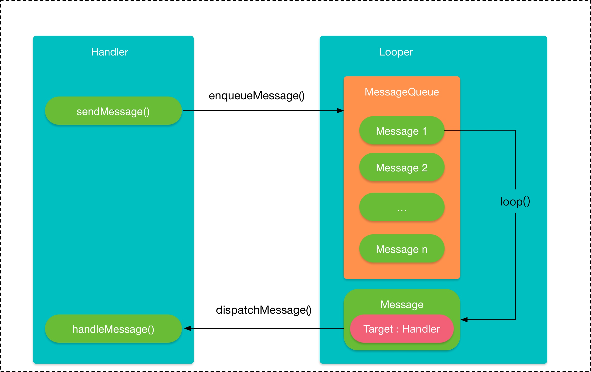

# Android Handler 机制 原理
Android消息循环流程图如下所示：

    
主要涉及的角色如下所示：

- message：消息。
- MessageQueue：消息队列，负责消息的存储与管理，负责管理由 Handler 发送过来的 Message。读取会自动删除消息，单链表维护，插入和删除上有优势。在其next()方法中会无限循环，不断判断是否有消息，有就返回这条消息并移除。
- Looper：消息循环器，负责关联线程以及消息的分发，在该线程下从 MessageQueue获取 Message，分发给Handler，Looper创建的时候会创建一个
  MessageQueue，调用loop()方法的时候消息循环开始，其中会不断调用messageQueue的next()方法，当有消息就处理，否则阻塞在messageQueue的next()方法中。当Looper的quit()被调用的时候会调用messageQueue的quit()，此时next()会返回null，然后loop()方法也就跟着退出。
- Handler：消息处理器，负责发送并处理消息，面向开发者，提供 API，并隐藏背后实现的细节。

整个消息的循环流程还是比较清晰的，具体说来：

- 1、Handler通过sendMessage()发送消息Message到消息队列MessageQueue。
- 2、Looper通过loop()不断提取触发条件的Message，并将Message交给对应的target handler来处理。
- 3、target handler调用自身的handleMessage()方法来处理Message。

事实上，在整个消息循环的流程中，并不只有Java层参与，很多重要的工作都是在C++层来完成的。我们来看下这些类的调用关系。

注：虚线表示关联关系，实线表示调用关系。

在这些类中MessageQueue是Java层与C++层维系的桥梁，MessageQueue与Looper相关功能都通过MessageQueue的Native方法来完成，而其他虚线连接的类只有关联关系，并没有直接调用的关系，它们发生关联的桥梁是MessageQueue。

##### 总结

- Handler 发送的消息由 MessageQueue 存储管理，并由 Looper 负责回调消息到 handleMessage()。
- 线程的转换由 Looper 完成，handleMessage() 所在线程由 Looper.loop() 调用者所在线程决定。

##### Handler 引起的内存泄露原因以及最佳解决方案

Handler 允许我们发送延时消息，如果在延时期间用户关闭了 Activity，那么该 Activity 会泄露。
这个泄露是因为 Message 会持有 Handler，而又因为 Java 的特性，内部类会持有外部类，使得 Activity 会被 Handler 持有，这样最终就导致 Activity 泄露。

解决：将 Handler 定义成静态的内部类，在内部持有 Activity 的弱引用，并在Acitivity的onDestroy()中调用handler.removeCallbacksAndMessages(null)及时移除所有消息。

##### 为什么我们能在主线程直接使用 Handler，而不需要创建 Looper ？

通常我们认为 ActivityThread 就是主线程。事实上它并不是一个线程，而是主线程操作的管理者。在 ActivityThread.main() 方法中调用了 Looper.prepareMainLooper() 方法创建了 主线程的 Looper ,并且调用了 loop() 方法，所以我们就可以直接使用 Handler 了。

因此我们可以利用 Callback 这个拦截机制来拦截 Handler 的消息。如大部分插件化框架中Hook ActivityThread.mH 的处理。

##### 主线程的 Looper 不允许退出

主线程不允许退出，退出就意味 APP 要挂。

##### Handler 里藏着的 Callback 能干什么？

Handler.Callback 有优先处理消息的权利 ，当一条消息被 Callback 处理并拦截（返回 true），那么 Handler 的 handleMessage(msg) 方法就不会被调用了；如果 Callback 处理了消息，但是并没有拦截，那么就意味着一个消息可以同时被 Callback 以及 Handler 处理。

##### 创建 Message 实例的最佳方式

为了节省开销，Android 给 Message 设计了回收机制，所以我们在使用的时候尽量复用 Message ，减少内存消耗：

- 通过 Message 的静态方法 Message.obtain()；
- 通过 Handler 的公有方法 handler.obtainMessage()。

##### 子线程里弹 Toast 的正确姿势

本质上是因为 Toast 的实现依赖于 Handler，按子线程使用 Handler 的要求修改即可，同理的还有 Dialog。

##### 妙用 Looper 机制

- 将 Runnable post 到主线程执行；
- 利用 Looper 判断当前线程是否是主线程。

##### 主线程的死循环一直运行是不是特别消耗CPU资源呢？ 

并不是，这里就涉及到Linux pipe/epoll机制，简单说就是在主线程的MessageQueue没有消息时，便阻塞在loop的queue.next()中的nativePollOnce()方法里，此时主线程会释放CPU资源进入休眠状态，直到下个消息到达或者有事务发生，通过往pipe管道写端写入数据来唤醒主线程工作。这里采用的epoll机制，是一种IO多路复用机制，可以同时监控多个描述符，当某个描述符就绪(读或写就绪)，则立刻通知相应程序进行读或写操作，本质是同步I/O，即读写是阻塞的。所以说，主线程大多数时候都是处于休眠状态，并不会消耗大量CPU资源。

##### handler postDelay这个延迟是怎么实现的？

handler.postDelay并不是先等待一定的时间再放入到MessageQueue中，而是直接进入MessageQueue，以MessageQueue的时间顺序排列和唤醒的方式结合实现的。

##### 如何保证在msg.postDelay情况下保证消息次序？##### 

[Handler 都没搞懂，拿什么去跳槽啊？](https://juejin.im/post/5c74b64a6fb9a049be5e22fc#heading-7)